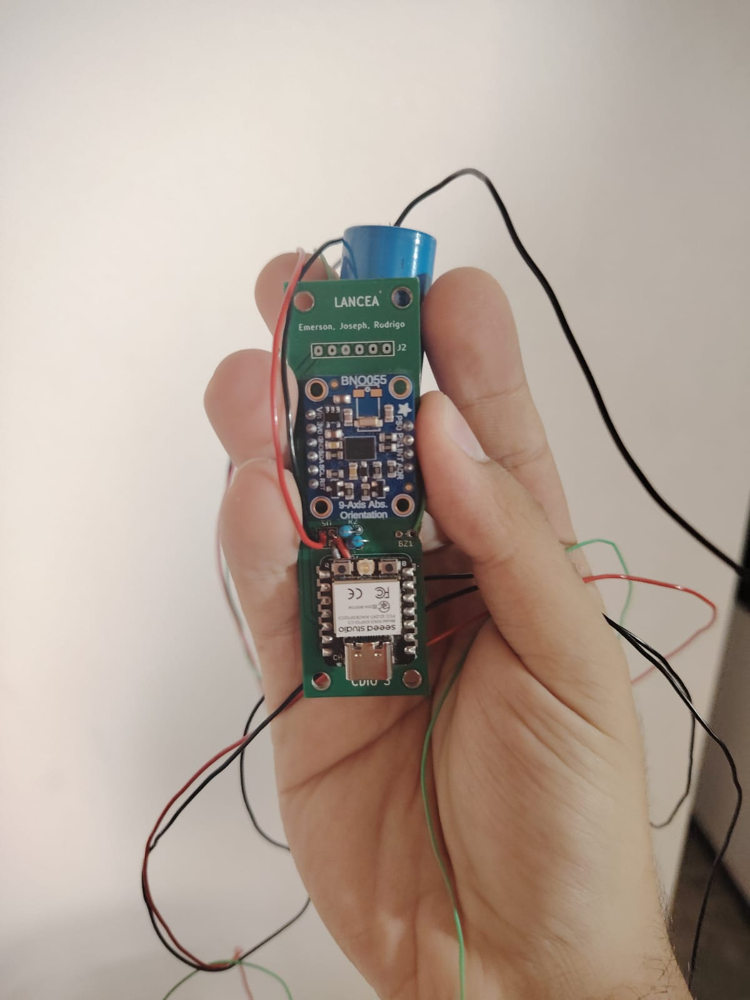
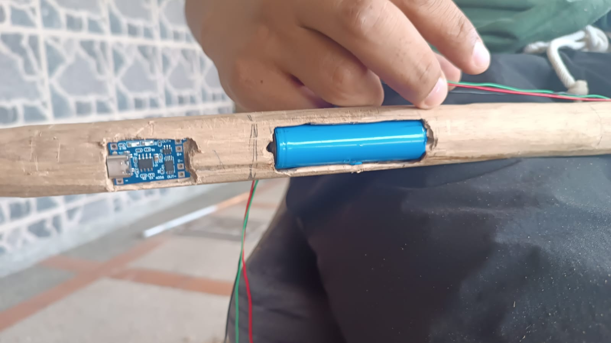

# 🔬 Pruebas de Concepto (PoC) - Semestre Anterior

Este documento recopila la investigación preliminar y las validaciones en hardware realizadas durante la fase de viabilidad del proyecto **LANCEA**. Estos resultados justifican la arquitectura técnica actual del sistema.

---

## 📐 1. Validación Dimensional y Mecánica

Uno de los mayores retos del proyecto era asegurar que la electrónica pudiera operar dentro de las estrictas restricciones aerodinámicas de un tubo deportivo, sin alterar el centro de gravedad.

### Objetivo de la Prueba
Validar que es posible ensamblar un sistema de adquisición de datos en una PCB con un ancho útil inferior al diámetro interno de una jabalina estándar.

### Resultados
Se logró diseñar e integrar un prototipo funcional que respeta el factor de forma cilíndrico, asegurando que la baquelita y la batería se deslizan sin tensión mecánica dentro del diámetro de prueba (aprox. 24mm - 25mm).

---

## ⚡ 2. Medición de Ángulo y Autonomía Energética

Para capturar la cinemática del vuelo, era crítico probar la viabilidad de estimar ángulos usando sensores inerciales y garantizar que el sistema de energía soportara una sesión completa de entrenamiento.

### Objetivo de la Prueba
1.  **Cinemática:** Leer el ángulo de inclinación estático utilizando un sensor MPU6050 inicial.
2.  **Energía:** Medir la tasa de descarga del sistema completo operando de forma continua.

### Resultados
* **Ángulo:** Se obtuvieron lecturas coherentes de inclinación (Pitch/Roll) procesando los datos crudos del sensor en el microcontrolador.
* **Autonomía:** El sistema demostró una operación continua superior a las expectativas iniciales utilizando celdas de Li-Ion, validando que una sola carga es suficiente para múltiples horas de recolección de datos en campo.

---

## 🚀 Conclusión y Transición a Fase 2

Los resultados exitosos de estas pruebas preliminares permitieron:
1.  Confirmar la viabilidad física del chasis impreso en 3D ("Sled").
2.  Justificar el *upgrade* del sensor MPU6050 al **BNO055** actual, para obtener cuaterniones por hardware y evitar el "Gimbal Lock" en vuelos dinámicos.
3.  Establecer la arquitectura de energía final basada en baterías 14500/18650 con gestión TP4056.

Estos antecedentes son la base sobre la cual se está desarrollando el firmware y hardware de alta velocidad de la versión actual.

---

## 🛠️ 3. Implementación Actual (Fase 2)

A partir de las conclusiones de las pruebas de concepto, se procedió a la materialización del hardware definitivo, logrando integrar con éxito las mejoras propuestas:

### Ensamble de PCB Definitiva

* **Avance:** Montaje exitoso de la PCB principal en formato "Strip". Se consolida el salto tecnológico integrando el microcontrolador **XIAO ESP32-C3** y el sensor inercial **BNO055** de alta precisión, respetando estrictamente el ancho máximo permitido por el diámetro interno de la jabalina.

### Integración Estructural del Sistema de Energía

* **Avance:** Mecanizado e integración del sistema de alimentación en un prototipo estructural (simulador de madera). Se comprueba el ajuste perfecto de la **batería Li-ion** y el módulo de carga **TP4056** en los compartimentos empotrados, garantizando que los componentes no sobresalgan del perfil cilíndrico ni comprometan la aerodinámica o el centro de masa del proyectil.
